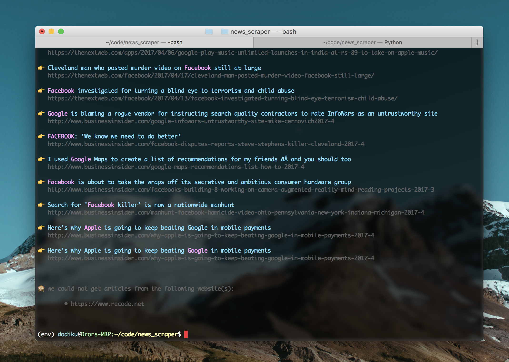

# Fernando's news scraper

Hey dude,  
Welcome to your new web scraper!

### How to install?
1. Download the project as a zip file.

1. Unzip the file.

1. Open your terminal app, navigate to the folder you just unzipped, and while you are on the project folder type -  
``$ virtualenv env``  
if you get an error (which means that the Python virtualenv package is not installed on your machine), run -  
``$ pip install virtualenv``  

1. Open the Python virtual environment by typing -  
``$ source env/bin/activate``  

1. Install all project dependencies by typing -  
``(env)$ pip install -r requirements.txt``  

All good?  
Let's rock 😎

### How to use?
1. You set up the list of websites you want to scrape on the ``websites.txt`` file.

1. You set up the companies you want to want to look for on the ``companies.txt`` file.

1. While inside the virtual environment and inside the project folder, run - ``python scraper.py``

### Results
The results should be:
* A list of articles on the terminal.

* A CSV file on the project folder.
